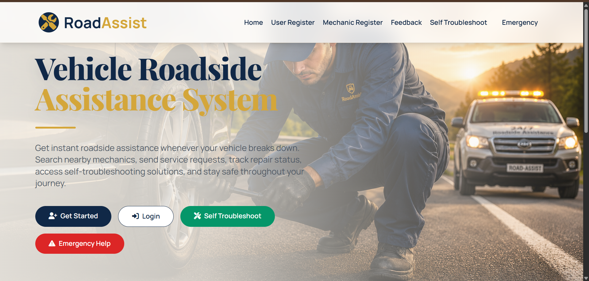
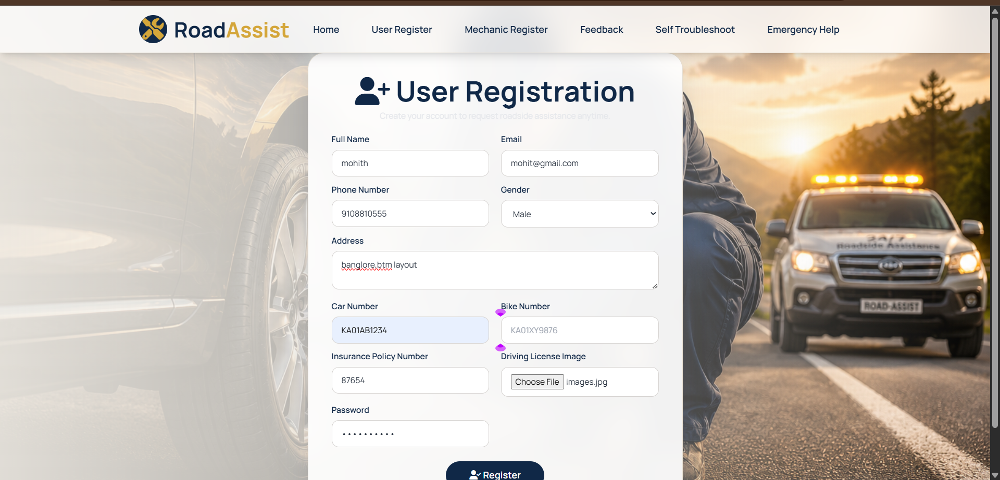
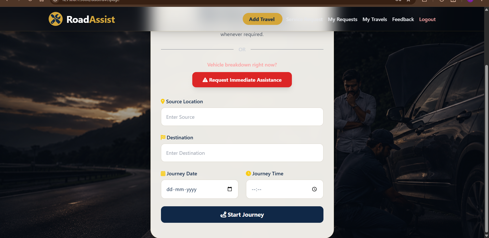
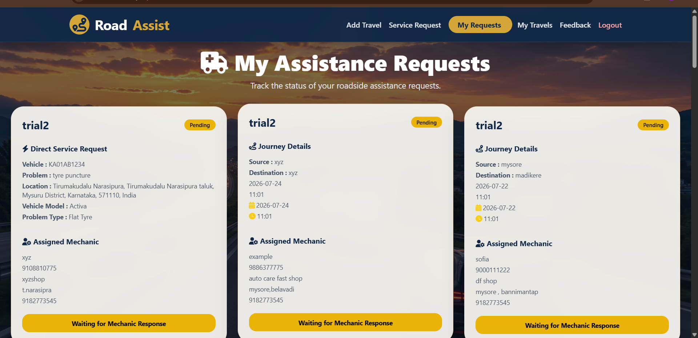
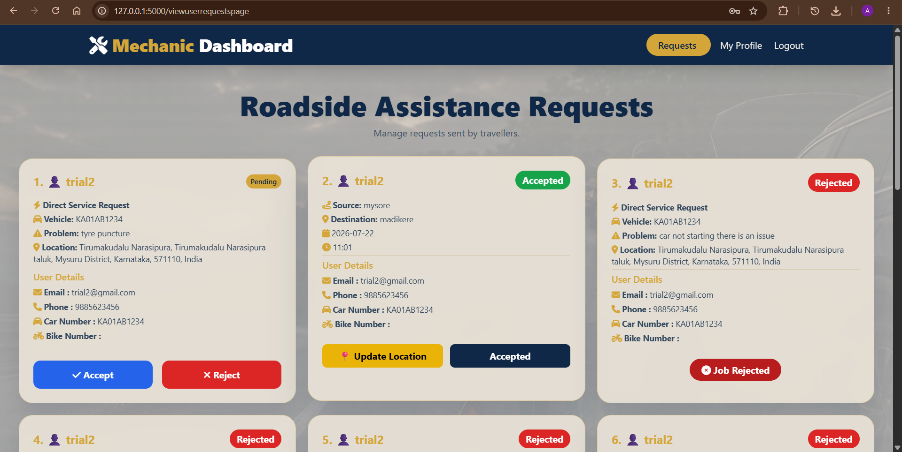
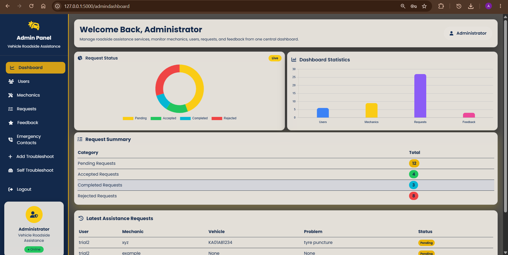
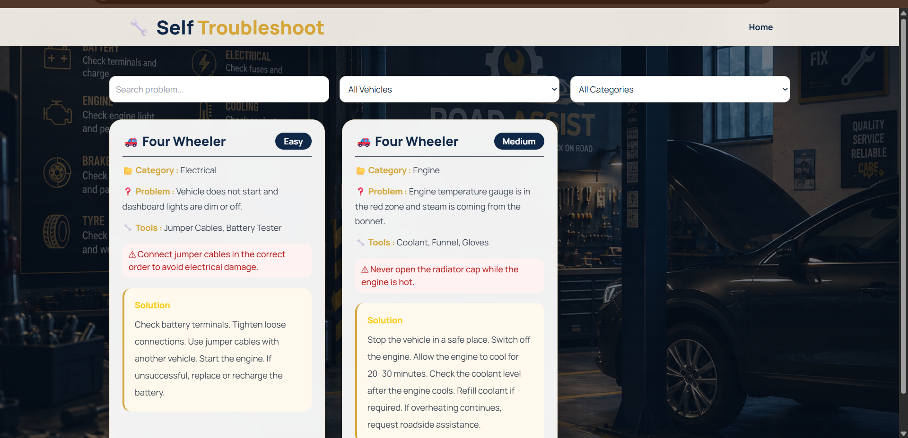
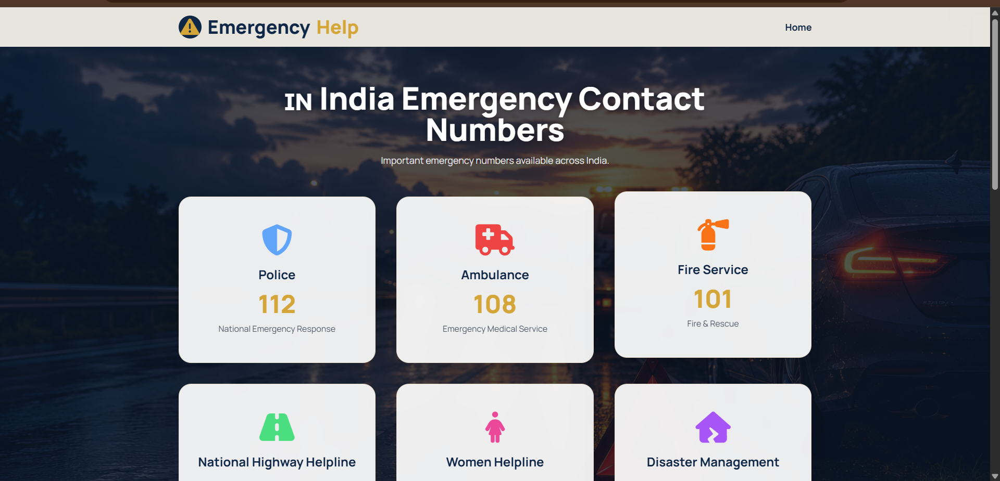

# Vehicle Roadside Assistance System

A web-based **Vehicle Roadside Assistance System** developed to connect vehicle users with mechanics and provide roadside assistance through an online platform.

## Technologies Used

- HTML5
- CSS3
- JavaScript
- Python
- Flask
- MySQL

## Key Features

- User Registration and Login
- Mechanic Registration and Login
- Admin Login
- User Dashboard
- Mechanic Dashboard
- Admin Dashboard
- Roadside Assistance Requests
- Mechanic Request Management
- Service Status Tracking
- Emergency Support
- Self Troubleshooting
- Travel and Journey Assistance
- Feedback and Reviews
- Mechanic Profile Management
- Emergency Contact Management

## Project Modules

### User Module
Users can register and log in, plan a journey, request roadside assistance, view and track service requests, access self-troubleshooting and emergency support, and provide feedback.

### Mechanic Module
Mechanics can register, manage their profile, view incoming roadside assistance requests, accept or reject requests, update service information, and manage job status.

### Admin Module
The administrator can manage users, mechanics, service requests, feedback, emergency contacts, troubleshooting content, and system activity through a centralized dashboard.

## Project Structure

```text
Vehicle-Roadside-Assistance-System/
├── app.py
├── db/
├── static/
│   └── screenshots/
├── templates/
├── .gitignore
└── README.md
```

## Database

The system uses **MySQL** to store application data including users, mechanics, service requests, feedback, emergency contacts, and related records.

## How to Run

1. Install Python and MySQL.
2. Install the required Python packages used by the project.
3. Create the project database using the SQL file provided in the `db` folder.
4. Configure the database connection in the Flask application.
5. Run the Flask application.
6. Open the local application URL in a web browser.

## Project Screenshots

### Home Page


### User Registration


### Service Request


### Mechanic Requests


### Mechanic Dashboard


### Admin Dashboard


### Self Troubleshoot


### Emergency Help


## Future Enhancements

- Real-time location tracking
- Online payment integration
- SMS and notification services
- Mobile application support
- Advanced mechanic location matching
